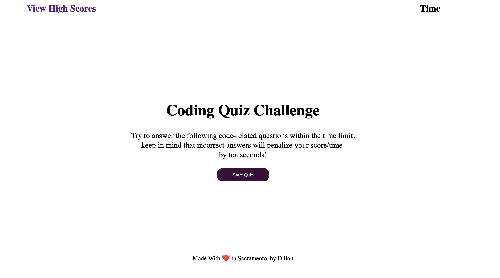

# JS-Quiz

## Purpose 
JavaScript quiz showing use of event listeners, dom querying, set interval functions, as well as utilizing local storage to save scores.
Objectives included updating the dom for each question and displaying whether the previous answer was correct or incorrect. As well as when the quiz was complete or the timer ran out save the score to local storage for data persistence. 

## Built With
* HTML
* CSS
* JavaScript

## First look

## Github repository 
https://github.com/Droth2/js-quiz

## Link to deployed app
https://droth2.github.io/js-quiz/index.html

## Contribution
Dillon Roth